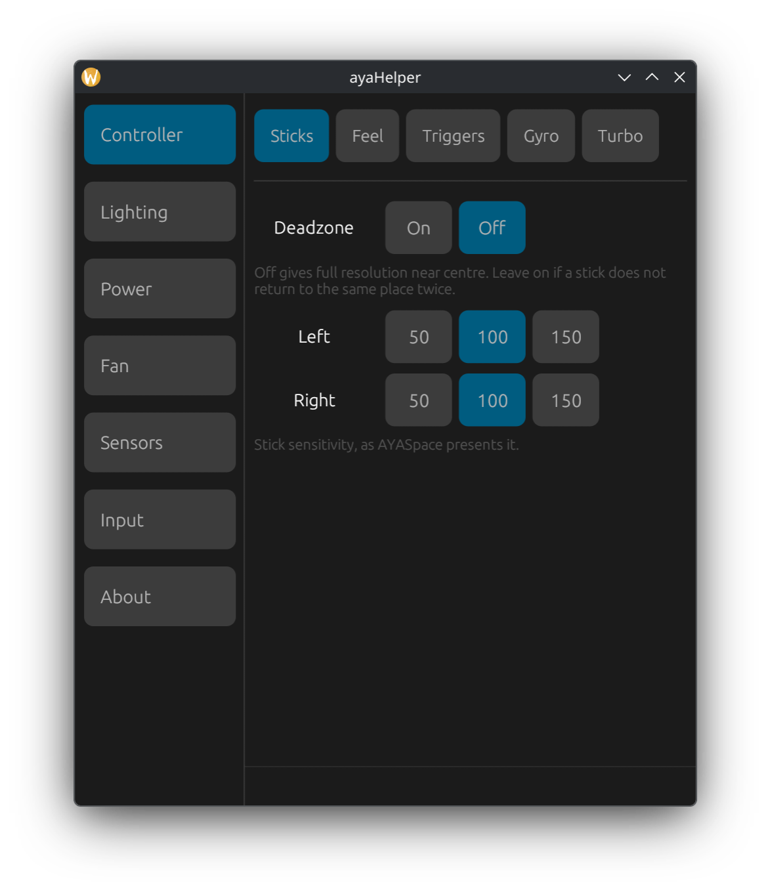
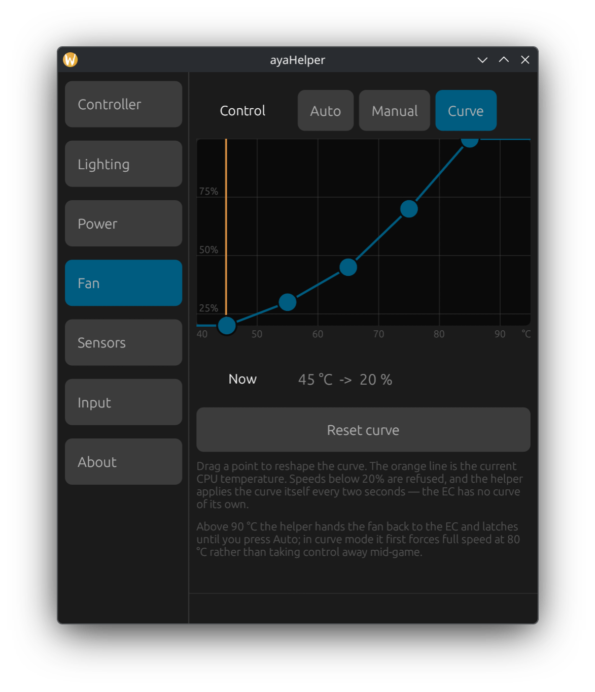
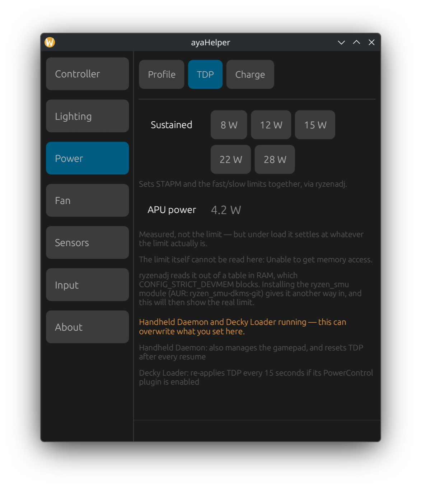
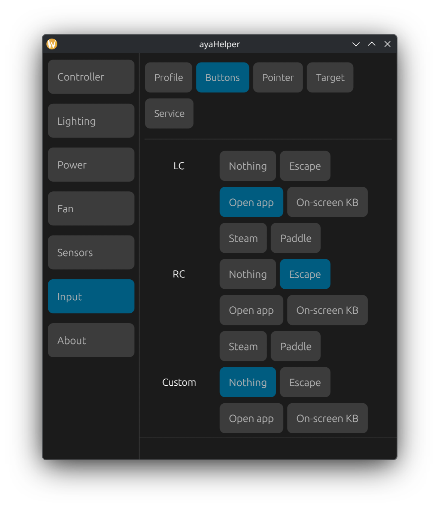
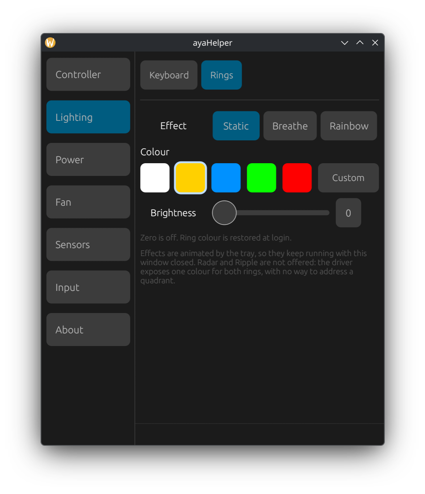
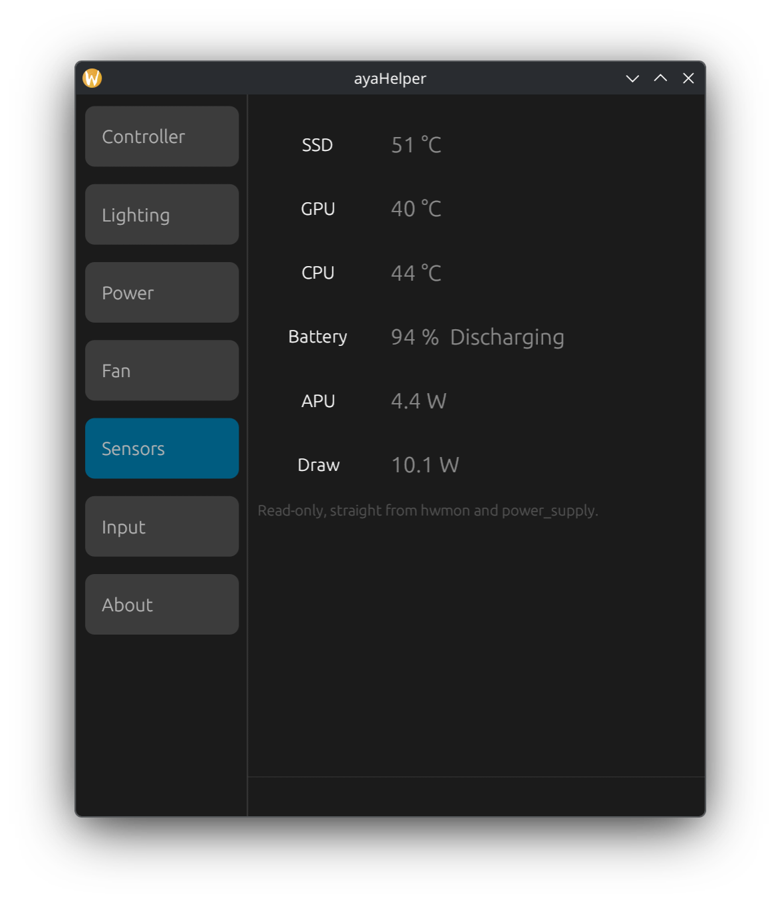

# ayaHelper

A small tray utility that gives AYANEO handhelds on Linux the settings AYASpace
gives them on Windows: controller feel, keyboard and ring lighting, fan control,
power limits, charging, and the handheld's own extra buttons.

It is one static binary, a privileged service for the two things that genuinely
need root, and a tray icon. No daemon of its own, no vendor driver, no Electron.

> **Read [Safety](#safety) before installing.** This writes to your embedded
> controller and to SMU power limits. It can overheat or destabilise the machine
> if it goes wrong. There is no warranty of any kind — see [No
> warranty](#no-warranty).

---

## Screenshots

| | |
|---|---|
| **Controller** — deadzone, per-stick sensitivity, rumble, triggers, gyro, turbo | **Fan** — a curve you drag, with the live temperature on it |
|  |  |
| **Power** — TDP, and a warning when something else is overwriting it | **Input** — bind the handheld's extra buttons |
|  |  |
| **Lighting** — ring colour and effects | **Sensors** — temperatures, APU power, battery |
|  |  |

---

## Contents

- [Screenshots](#screenshots)
- [What it does](#what-it-does)
- [Tested hardware](#tested-hardware)
- [Requirements](#requirements)
- [Install](#install)
- [Using it](#using-it)
- [The handheld's extra buttons](#the-handhelds-extra-buttons)
- [How it works](#how-it-works)
- [Things that do not work on this hardware](#things-that-do-not-work-on-this-hardware)
- [Other software you may be running](#other-software-you-may-be-running)
- [Troubleshooting](#troubleshooting)
- [Safety](#safety)
- [No warranty](#no-warranty)

---

## What it does

| Tab | Controls |
|---|---|
| **Controller** | Stick deadzone and per-stick sensitivity, rumble strength, swap ABXY, trigger and gyro levels, per-button turbo, factory reset |
| **Lighting** | Keyboard backlight colour, effect, brightness and Fn light; joystick ring colour, brightness and effects |
| **Power** | ACPI platform profile, sustained TDP, charge limit and bypass |
| **Fan** | Automatic, a fixed speed, or a temperature curve you drag |
| **Sensors** | Temperatures, APU package power, battery state |
| **Input** | InputPlumber profile, button bindings, pointer speed and deadzone, emulated controller, service control |
| **About** | UI scale, device paths, versions |

Everything is applied immediately and saved, and re-applied at login.

## Tested hardware

**Developed and tested on exactly one machine: an AYANEO SLIDE (board `AS01`,
EC `0x001b0100`) running CachyOS with KDE Plasma on Wayland.**

That is a narrow base, and it matters:

- Feature gates are on board name and EC version, so on another AYANEO some tabs
  will correctly show as unavailable — but others may *appear* available and
  write registers that mean something different on your machine.
- The gamepad protocol is shared across AYANEO models, so the Controller tab is
  the most likely to work elsewhere. The fan and charging registers are the
  least likely.
- Nothing here has been tested on a non-AYANEO device and it should not be run
  on one. The model gate is a guard, not a guarantee.

If you run it on something else, read [Safety](#safety) first and start with the
read-only `--status`.

## Requirements

**Required**

- A recent Linux kernel with the **`ayaneo-platform`** module loaded. This
  drives the ring LEDs and provides the battery's `charge_behaviour`. Without it
  the Lighting → Rings and Power → Charge pages show as unavailable.
- **systemd** — used for the services, and `busctl` is how this talks DBus.

**Optional, per feature**

| For | Install | Without it |
|---|---|---|
| TDP control | **`ryzenadj`** | Power → TDP is inert |
| Reading TDP back | **`ryzen_smu`** kernel module (AUR: `ryzen_smu-dkms-git`) | The page shows measured APU power instead of the limit, and says so |
| Stick-as-mouse, button bindings, emulated controllers | **InputPlumber** | The whole Input tab is unavailable |

`ryzen_smu` is genuinely optional. `ryzenadj` reads its limits out of a table in
ordinary RAM, which `CONFIG_STRICT_DEVMEM` blocks on most kernels — so without
that module the TDP page cannot show what is actually in force, only what it
last set.

### Configuring InputPlumber

InputPlumber ships a config for this device. The pieces worth knowing:

- `/usr/share/inputplumber/devices/50-ayaneo_slide.yaml` has `auto_manage: true`,
  so the built-in controller is managed whether or not "Manage all" is on.
- `capability_map_id: aya5` is what turns the handheld's extra buttons into
  gamepad capabilities. Without it LC and RC produce nothing at all.
- Profiles live in `/usr/share/inputplumber/profiles/` and
  `/etc/inputplumber/profiles/`; the second wins on a name clash. Put custom
  profiles in `/etc`.

## Install

### From a release

[Releases](https://github.com/dimitriuz/ayahelper/releases) carry a tarball with
the binary, the `rootfs/` it needs and an installer:

```bash
tar -xzf ayahelper-<version>-x86_64-linux.tar.gz
cd ayahelper-<version>-x86_64-linux
./install.sh
```

The binary is built on Ubuntu, so it wants that glibc or newer — fine for the
rolling distributions these handhelds run, but building from source avoids the
question entirely and is equally supported.

### Build

```bash
cargo build --release
```

Rust stable. The only system dependencies are those of `eframe`/`glow` — Wayland
or X11 client libraries and OpenGL, which a desktop already has.

### Install

```bash
sudo install -m755 target/release/ayahelper /usr/bin/ayahelper
sudo cp -r rootfs/usr/. /usr/.
sudo udevadm control --reload && sudo udevadm trigger
sudo systemctl enable --now ayahelper-privileged.service
systemctl --user enable --now ayahelper.service ayahelper-restore.service
```

Then **log out and back in**, or re-plug nothing and just run
`udevadm trigger` — the udev rules grant your session access to the gamepad
UART and the keyboard backlight, and the running session needs to pick them up.

Check it:

```bash
$ ayahelper --status
devices:
  gamepad   /dev/ttyS2
  keyboard  /dev/hidraw1
  rings     /sys/class/leds/ayaneo:rgb:joystick_rings
```

Any `unavailable` line names what is missing and why.

### What gets installed

| Path | What |
|---|---|
| `/usr/bin/ayahelper` | the binary — tray, window, privileged service and CLI in one |
| `/usr/lib/systemd/system/ayahelper-privileged.service` | the privileged service (fan, TDP, charge limit, platform profile) |
| `/usr/lib/systemd/user/ayahelper.service` | the tray icon |
| `/usr/lib/systemd/user/ayahelper-restore.service` | re-applies saved settings at login |
| `/usr/lib/udev/rules.d/70-ayahelper.rules` | grants the session user the gamepad UART, the keyboard backlight interface and the ring LEDs |
| `/usr/share/applications/ayahelper.desktop` | the launcher entry |

State lives in `~/.config/ayahelper/settings.json` (per user) and
`/var/lib/ayaneo/` (device-wide: the charge limit, and the records shared with
the standalone `gulikit-ctl` and `ayaneo-kbdlight` scripts).

### Uninstall

```bash
systemctl --user disable --now ayahelper.service ayahelper-restore.service
sudo systemctl disable --now ayahelper-privileged.service
sudo rm /usr/bin/ayahelper \
        /usr/lib/systemd/system/ayahelper-privileged.service \
        /usr/lib/systemd/user/ayahelper{,-restore}.service \
        /usr/lib/udev/rules.d/70-ayahelper.rules \
        /usr/share/applications/ayahelper.desktop
sudo systemctl daemon-reload
```

Stopping the privileged service hands the fan back to the EC's own curve, so
removing this cannot leave the fan stuck.

## Using it

Click the tray icon, or map a handheld button to open it (see below). The window
is a separate process from the tray: closing it closes a window, and the tray is
untouched.

### Command line

```
ayahelper                run the tray icon (default)
ayahelper --window       open the settings window
ayahelper --status       print device and settings state, change nothing
ayahelper --restore      re-apply saved settings and exit (for a login unit)
ayahelper --map B A      bind handheld button B to action A (no args: list them)
ayahelper --privileged   run the privileged part (systemd service)
ayahelper --fan-auto     hand the fan back to the EC and exit (failsafe)
```

`--status` is read-only and is the right first command on a new machine.

`--fan-auto` is the panic button: it restores the EC's own fan control and
exits, and it is what the service runs on any shutdown path.

## The handheld's extra buttons

**LC and RC appear to do nothing out of the box, and it is not your setup.**
They are delivered correctly — InputPlumber's `aya5` capability map turns the
chords the keyboard MCU sends into the gamepad capabilities `LeftTop` and
`RightTop` — but the stock profile then maps those to **Xbox Elite paddles**.
With any other emulated controller selected, the pad has no paddles, so the
press is translated and then silently dropped.

Input → Buttons rebinds them, or:

```bash
$ ayahelper --map
  buttons: LeftTop (LC), RightTop (RC), QuickAccess (Custom)
  actions: none, esc, app, osk, guide, paddle

$ ayahelper --map RightTop esc      # RC sends Escape
$ ayahelper --map LeftTop app       # LC opens this window
```

| Action | What it does |
|---|---|
| `none` | unbound |
| `esc` | sends Escape |
| `app` | opens the ayaHelper window — the way in with no pointer attached |
| `osk` | asks the desktop for an on-screen keyboard (needs one installed; see below) |
| `guide` | the Steam/Guide button |
| `paddle` | an Xbox Elite back paddle — **only exists on the Xbox Elite target** |

`app` and `osk` are handed to the desktop as InputPlumber DBus actions rather
than pressed as keys. This app answers `app`. Nothing answers `osk` unless a
Plasma input-method backend is installed and selected — KWin reports
`available = false` for its virtual keyboard until then.

## How it works

Four separate transports, because the hardware has four.

**The gamepad** is a GuLiKit MCU on an on-board 16550 UART at I/O `0x3E8`
(`/dev/ttyS2`), 115200 8N1. Settings are one 15-byte record, framed
`E7 <8 payload> <checksum> ED`, acknowledged with `e7 55 aa <status> ed`. The MCU
cannot be read back, so the saved copy is authoritative — the same design
AYASpace uses.

**The keyboard backlight** is a HID feature report, id `0x41`, eight bytes, on
interface 01 of the keyboard MCU. Interface 00 is the real keyboard and is
deliberately *not* granted by the udev rule, since access to it would mean
access to keystrokes.

**The ring LEDs** are a standard multicolour LED class device provided by
`ayaneo-platform`, so that part is plain sysfs. Effects are animated here rather
than by the EC: AYASpace's ring "modes" are host-side animations too — its LED
thread switches on the mode and calls a different animation function for each.
Both the tray and the window run the animator and an `flock` decides which one
drives it, so whichever is alive does the work.

**The EC** is reached over the ITE SuperIO index/data ports `0x4E`/`0x4F` —
register `0x11` selects the page, `0x10` the index, `0x12` is the data window.
That is raw port I/O through `/dev/port`, which is why fan control is the one
thing that needs the privileged service.

### The privileged service

Only four things need root: raw port I/O for the fan, `ryzenadj` for SMU limits,
the ACPI platform profile, and the charge limit. They live in a small service
that speaks a line protocol over a Unix socket at
`/run/ayahelper/privileged.sock`, mode 0660, group `wheel`. Everything else —
the gamepad UART, the keyboard backlight, the ring LEDs, all of InputPlumber —
runs as you, via udev `uaccess`.

### Fan control has three guards

Holding a fan at a fixed speed is the one thing here that can damage hardware,
so a supervisor thread checks the CPU temperature every two seconds and:

- **85 °C** — forces the EC's automatic control back on.
- **90 °C** — gives up permanently and latches, on the grounds that if full
  speed did not hold it, the EC's own curve is a better bet than ours.
- **Sensor lost** — hands control back rather than hold a speed blind.

The service also restores automatic control on exit, including an unclean one,
via `ExecStopPost`.

## Things that do not work on this hardware

Established by testing, not assumed. Kept in the UI because the code is correct
and a firmware update could change the answer — but the app says so rather than
pretending.

**Charge limit and bypass charging.** The kernel exposes `charge_behaviour` and
the write reaches EC `0xd1d1` — confirmed by reading the register back — and the
battery charges straight through it at full rate. A plug cycle does not help,
and both documented values charge when actually written. It is not a wrong
register: AYASpace's own `system.set_charge_config` takes the identical path for
this board, and its charge policy and bypass switch do nothing on this unit
either, on Windows. The app measures this and reports `honoured=no` rather than
showing a limit it cannot hold.

**Radar and Ripple ring effects.** The driver exposes one colour for both rings
(`multi_index` is `red green blue`) with no way to address a quadrant, so
positional effects cannot be done through it at all.

**Motion EX.** Needs AYASpace's own kernel driver and service to inject motion;
it is not a hardware setting, so there is nothing to port. Map the gyro in
InputPlumber instead — it already has it as a source.

**VRAM size.** AYASpace calls a WMI method provided by a *Windows driver*, not by
firmware: there is no `_WDG` in the DSDT or any SSDT here and `/sys/bus/wmi/devices/`
is empty. The setting lives in a UEFI setup blob. **Change it in BIOS setup** —
writing undocumented offsets into firmware variables is a bricking risk for no
gain over the menu, which needs the same reboot.

## Other software you may be running

Handheld distributions ship daemons that drive the same hardware and do not
coordinate. The Power and Input tabs name whichever are running, because the
failure is otherwise silent — the control still moves, it just stops meaning
anything.

- **Decky Loader** — its PowerControl plugin re-runs `ryzenadj` every 15 seconds,
  so a TDP set here is gone well before you have put the device down.
- **Handheld Daemon (hhd)** — manages the gamepad that InputPlumber is also
  managing, and resets TDP after every resume.

Pick one owner per setting. `ayahelper --status` lists what it found.

## Troubleshooting

**The controller disappears after suspend.** Expected, and not fixable from
software: the gamepad MCU powers down during the bus suspend and its descriptor
has the remote-wakeup bit clear (`bmAttributes 0x80`), so it cannot ask the host
to bring it back. Its UART goes quiet at the same time, so there is nothing to
send a wake command to either. **Press any button on the pad** and it re-attaches;
InputPlumber picks it up again with its profile and settings intact.

**A device shows as unavailable.** The udev rules have not been applied to the
running session:

```bash
sudo udevadm control --reload && sudo udevadm trigger
```

If it persists, `ayahelper --status` distinguishes "nothing opens" (permissions)
from "opens but nothing answers" (the MCU is asleep — press a button).

**TDP does nothing.** Either `ryzenadj` is missing, or something else is
re-applying it — check the warning on the Power → TDP page. If the privileged
service reports `PCI Bus is not writeable, check secure boot`, that message is
misleading: it means the service lacks `CAP_SYS_ADMIN`, which the shipped unit
grants.

**Ring effects freeze.** The animator runs in whichever of the tray and window
is alive. If you quit the tray from its menu *and* close the window, nothing is
left to animate them.

**Settings seem to revert.** An open settings window owns the settings file — it
holds the whole struct in memory and rewrites it on any change. `--map` hands
bindings to a running window for exactly this reason; if you edit the file by
hand while the window is open, the window wins.

## Safety

This writes directly to hardware. Specifically:

- **Raw port I/O to the embedded controller** (`/dev/port`) for fan control.
  Writing the wrong EC register on an untested model can do things this code has
  no idea about.
- **SMU power limits** via `ryzenadj`, which are not bounded by anything except
  the range in this code.
- **Holding the fan at a fixed speed**, which is capable of overheating the
  machine. The three guards described above exist because of this, but a guard
  depends on a temperature sensor being readable and on this process still
  running.

Reasonable precautions if you are trying it on anything other than a tested
AYANEO SLIDE:

1. Run `ayahelper --status` first. It writes nothing.
2. Leave the fan on **Auto** until you are satisfied the Sensors tab reports a
   plausible CPU temperature.
3. Do not run this alongside another fan or TDP controller.
4. `ayahelper --fan-auto` restores the EC's own fan control at any time.

## No warranty

**This software is provided "as is", without warranty of any kind, express or
implied. You run it entirely at your own risk. The authors accept no
responsibility or liability for any damage to your hardware, loss of data, or
any other harm arising from its use.**

This is an unofficial project. It is not affiliated with, endorsed by, or
supported by AYANEO, and it is built on reverse engineering rather than on any
vendor documentation. Nothing here is guaranteed to be correct for your machine,
your firmware version, or your kernel.

If that is not acceptable, do not install it.

## Licence

GPL-2.0-or-later.

The protocol work this is built on — the gamepad UART, the keyboard backlight
report, the EC registers, and the AYASpace decompilation behind them — is
documented in the [ayaneo-slide-fixes](https://github.com/dimitriuz/ayaneo-slide-fixes)
repository.
